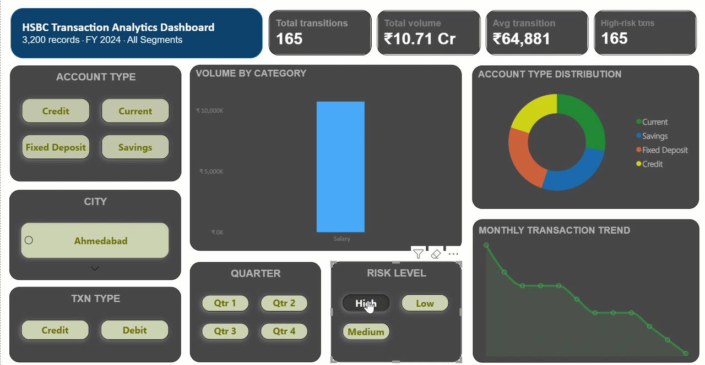

# HSBC Transaction Analytics Dashboard

A synthetic dataset of 3,200 customer transactions from HSBC Bank, complete with a statistical analysis dashboard and Power BI implementation guide.

---

## Project overview

This project generates a realistic banking transaction dataset for exploratory data analysis, statistical modelling, and business intelligence dashboarding. It includes a browser-based interactive dashboard, a clean CSV export, and a Power BI blueprint with DAX formulas and layout guidance.

---

## Repository contents

| File | Description |
|---|---|
| `HSBC_Transactions_3200.csv` | Main dataset — 3,200 synthetic transaction records |
| `HSBC Transaction Analytics Dashboard.pbix` | Standalone preview of the Power BI dashboard layout |
| `README.md` | This file |

---

## Dataset

### Source
Synthetically generated using a seeded random number generator (seed = 42) to ensure reproducibility. All names, amounts, and transaction details are fictional and do not represent real customers or financial data.

### Schema

| Column | Type | Description |
|---|---|---|
| Customer ID | Text | Unique identifier — format `HSBC10001` to `HSBC13200` |
| Name | Text | Full name (first + last) |
| Account Type | Text | One of: Savings, Current, Credit, Fixed Deposit |
| Category | Text | One of 15 transaction categories (see below) |
| Transaction Type | Text | Credit or Debit |
| Amount (INR) | Integer | Transaction amount in Indian Rupees — range ₹100 to ₹1,02,468 |
| Date | Date | ISO 8601 format (YYYY-MM-DD) — spans 1 Jan 2024 to 30 Dec 2024 |
| City | Text | One of 15 major Indian cities |
| Risk Level | Text | Low (≤₹15,000) / Medium (₹15,001–₹50,000) / High (>₹50,000) |

### Transaction categories
Grocery, Utilities, Salary, Rent, EMI, Shopping, Travel, Healthcare, Education, Dining, Insurance, Investment, Transfer, ATM Withdrawal, Online Purchase

### Data quality
The dataset passed all quality checks:
- 0 missing values across all 9 columns
- 0 duplicate rows or Customer IDs
- 0 invalid dates, negative or zero amounts
- 0 domain value violations
- 0 risk label mismatches

> **Note on outliers:** 469 transactions (14.7%) fall above the IQR upper fence of ₹18,978. These are legitimate high-value entries (Salary, Rent, Investment). No removal is needed, but consider log-transforming `Amount (INR)` before regression or clustering models.

---

## Power BI dashboard

### Visuals included
- 4 KPI cards — Total Transactions, Total Volume, Avg Transaction, High-Risk Count
- Clustered bar chart — Volume by Category
- Line chart — Monthly Transaction Trend
- Donut chart — Account Type Distribution
- 5 slicers — Account Type, Transaction Type, Quarter, Risk Level, City

### Calculated columns and measures (DAX)

```dax
Month Name   = FORMAT('HSBC_Transactions_3200'[Date], "MMM YYYY")

Month Number = MONTH('HSBC_Transactions_3200'[Date])

Quarter      = "Q" & TEXT(QUARTER('HSBC_Transactions_3200'[Date]), "0")
Amount Band  = IF([Amount (INR)] <= 5000, "0–5K",
               IF([Amount (INR)] <= 15000, "5K–15K",
               IF([Amount (INR)] <= 50000, "15K–50K", "50K+")))
               
High Risk %     = DIVIDE(
                    COUNTROWS(FILTER('HSBC_Transactions_3200', 'TransactHSBC_Transactions_3200'[Risk Level] = "High")),
                    COUNTROWS('HSBC_Transactions_3200'))
```

### Setup steps
1. Open Power BI Desktop → **Get Data → Text/CSV** → select `HSBC_Transactions_3200.csv`
2. In Power Query, set `Amount (INR)` to Whole Number and `Date` to Date type
3. Close & Apply
4. Add the calculated columns above via **New Column**
5. Sort `Month Name` by `Month Number` (Column Tools → Sort by Column)
6. Build visuals as per the blueprint in `HSBC Transaction Analytics Dashboard.pbix`

---



## Usage ideas

- **Descriptive analytics** — spend patterns by city, category, account type
- **Segmentation** — k-means clustering on Amount + Category + Risk
- **Anomaly detection** — flag high-value outliers or unusual transaction frequency
- **Time series analysis** — monthly/quarterly trend modelling
- **Credit risk modelling** — classify High/Medium/Low risk using ML classifiers
- **Student projects** — practice data cleaning, EDA, and dashboarding with realistic banking data

---

## Disclaimer

This dataset is entirely synthetic. All customer names, transaction amounts, and account details are fictional. This project is intended for educational and analytical purposes only and has no affiliation with HSBC Bank or any real financial institution.

---

*Generated with Claude — April 2026*
